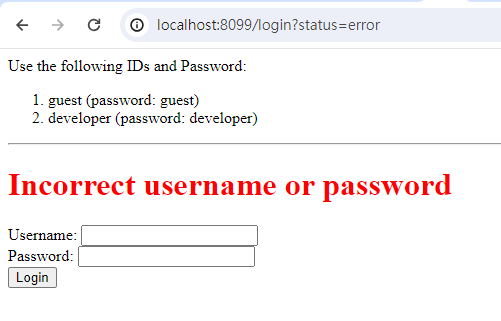
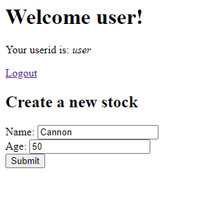
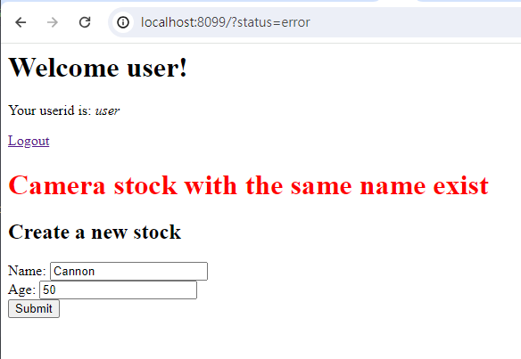

# COMPS381F - Group Project - Camera Stock

Group: 11
Name: 
Tso Kin Long (12467807)

Application link: https://s381f-project-camera-stock.onrender.com/

### Purpose

The purpose of this project is used to create management for camera stock and we can review the data on our web application.

This application provide a interface create and manage a camera stock, and retreive the data from the database and display on specific page. Also provide corresponding url for RESTful api access.

### Login/Logout testing

This app using cookie session (used in Lab7) to persist user session.

By default, when user hit the root `"/"` url without authentication, the website will redirect user to `"/login"` page.

There are two user login data is hard coded at the begin of the script.

```js
const users = [
  { name: "admin", password: "admin" },
  { name: "user", password: "user" },
];
```

You can use the one you like to fill in the login form on the `"/login"` page.

Without the session, user cannot access the root `"/"` page.

You can test the session by `console.log(session);` in the `app.get("/")` request.

If incorrect data is provided, user will redirect to `"/login"` page again with parameter `?status=error` and the error message show above the login form.



If login successful, you will redirect to root `"/"` page.



You can click the `logout` button to clear the session.

### CRUD Service & RESTful API

#### Create new camera stock

1. GET (Get all cameras stock/with criteria (the name of the camera))

```
localhost:8099/camera
https://s381f-project-camera-stock.onrender.com/camera
localhost:8099/camera/name/Cannon
https://s381f-project-camera-stock.onrender.com/camera/name/Cannon
```

User can directly access the link `"localhost:8099/camera"` to access the page which retreives all camera stocks data from the database; or access `"localhost:8099/camera/name/Cannon"` to retreives the data base on the name of the camera (You can replace `"Cannon"` with other name that user would like to search about).

---

2. (RESTful) GET (Similar as above, while return the html/json data)

```
curl -X GET localhost:8099/camera
curl -X GET https://s381f-project-camera-stock.onrender.com/camera
curl -H "content-type: application/json" -X GET localhost:8099/camera
curl -H "content-type: application/json" -X GET https://s381f-project-camera-stock.onrender.com/camera

curl -X GET localhost:8099/camera/name/Cannon
curl -X GET https://s381f-project-camera-stock.onrender.com/camera/name/Cannon
curl -H "content-type: application/json" -X GET localhost:8099/camera/name/Cannon
curl -H "content-type: application/json" -X GET https://s381f-project-camera-stock.onrender.com/camera/name/Cannon

```

For the request without `"content-type: application/json"`, the app will return the user the ejs in html text. If the command with `"content-type: application/json"`, it will return the data in JSON formate.

---

3. (RESTful) POST (Create new camera stock)

```
curl -H "content-type: application/json" -X POST -d '{"name":"Sony","quantity": 20}' localhost:8099/camera/create
curl -H "content-type: application/json" -X POST -d '{"name":"Sony","quantity": 20}' https://s381f-project-camera-stock.onrender.com/camera/create
```

This api endpoint can be hit through the create form root `"/"` page.


Or using the `curl` command to execute as a RESTful api.

By default the create process will check is the name of the camera exist or not. If already exist, the response will redirect the user back to the root `"/"` page with the parameter `?status=error` and a error message will show above the create form.



---

4. (RESTful) PUT (Update the exist record)

```
// curl -X PUT localhost:8099/camera/name/:name/quantity/:quantity

curl -X PUT localhost:8099/camera/name/Nikkon/quantity/15
curl -X PUT https://s381f-project-camera-stock.onrender.com/camera/name/Nikkon/quantity/15
```

By providing the name and the quantity, the api find the record that fitting the name and update the quantity of this record.

It will return a JSON data with the name and the updated quantity after successful updating. If there are no record match the name, the response will return the null object `{}`.

You can also check the updated data through the GET request or access the `"/camera"` page.

---

5. (RESTful) DELETE (Delete the record fulfill the criteria)

```
// curl -X DELETE localhost:8099/camera/name/:name

curl -X DELETE localhost:8099/camera/name/Nikkon
curl -X DELETE https://s381f-project-camera-stock.onrender.com/camera/name/Nikkon
```

User can delete the record by providing the name of the camera. If the delete is success, a JSON data response will return, e.g.:

```
{"acknowledged":true,"deletedCount":1}
```

You can also check the updated data through the GET request or access the `"/camera"` page.
